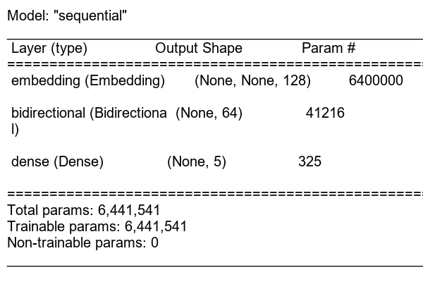

# News-Articles-Sorting
## Overview
With News companies having terabytes of data stored in
servers, everyone is in the quest to discover insights that add value to the organization.
With various examples to quote in which analytics is being used to drive actions, one that
stands out is news article classification. Nowadays on the Internet there are a lot of sources that generate immense amounts of
daily news. In addition, the demand for information by users has been growing
continuously, so it is crucial that the news is classified to allow users to access the
information of interest quickly and effectively. This way, the machine learning model for
automated news classification could be used to identify topics of untracked news and/or
make individual suggestions based on the user’s prior interests.

## Tools


- Anaconda: https://www.anaconda.com/
- Vs code: https://code.visualstudio.com/download
- Git: https://git-scm.com/
- Flowchart: https://whimsical.com/
- DVC : https://dvc.org/
- MlFlow : https://mlflow.org/
- Dagshub : https://dagshub.com/
- Whimsical : https://whimsical.com/
- MongoDB: https://account.mongodb.com/account/login
- Azure: https://portal.azure.com/
- Gradio: https://www.gradio.app/
- Data Link : https://www.kaggle.com/datasets/jacopoferretti/bbc-articles-dataset

## Git Commands
```
git add .
git commit -m "message"
git push origin main
```

## Virtual Environmant Commands (Anaconda)
```
conda create -n <environament_name> python=<version> -y
conda activate <environament_name>
conda deactivate
```

## Environment Variables
```
export MONGODB_URI = "mongodb+srv://<username>:<password>...."
export AZURE_CLIENT_ID = <AZURE_CLIENT_ID>
export AZURE_TENANT_ID = <AZURE_TENANT_ID>
export AZURE_CLIENT_SECRET = <AZURE_CLIENT_SECRET>
export AZURE_STORAGE_URL = <AZURE_STORAGE_URL>
```

## MongoDB for Data Storage and Retrieval

MongoDB is a NoSQL, document-oriented database. It stores data in flexible, JSON-like documents called BSON, making it suitable for handling data that doesn't fit well into traditional rows and columns.

### Connection Syntax

```
import os
from pymongo.mongo_client import MongoClient
from pymongo.server_api import ServerApi

uri = os.getenv('MONGODB_URI')

# Create a new client and connect to the server
client = MongoClient(uri, server_api=ServerApi('1'))

# Send a ping to confirm a successful connection
try:
    client.admin.command('ping')
    print("Pinged your deployment. You successfully connected to MongoDB!")
except Exception as e:
    print(e)
```
### Data Storage Syntax

```
data_base = client[DB_NAME]
collection = data_base[COLLECTION_NAME]

rec = collection.insert_many(data)
```

### Data Retrieval Syntax

```
records = collection.find()
```

## Model Summary
A model summary provides a concise overview of a machine learning model's architecture




## MLFLOW
MLflow Experiment Tracking allows you to record and compare different runs of your machine learning experiments. It helps you keep track of parameters, metrics, and artifacts associated with each experiment run, facilitating model comparison, analysis, and selection. By providing a centralized repository for experiment data, MLflow helps data scientists and engineers understand model behavior, reproduce experiments, and collaborate more effectively.

### Syntax
```
import mlflow
with mlflow.start_run():
  mlflow.log_param('parameter name', 'value')
  mlflow.log_metric('metric name', 1)
```

### Experiment Tracking


### mlflow URI
Visit this url to compare all the experiment conducted during the evaluation by yourself.

project_mlflow_uri : https://dagshub.com/nikhil.sonkusare94/News-Articles-Sorting.mlflow

## DVC Tracking
DVC (Data Version Control) pipelines are a series of data processing stages that produce a final result, such as a trained machine learning model. DVC pipelines are defined in a dvc.yaml file using a YAML-based syntax. Each stage in the pipeline is defined as a separate entry with properties like cmd, deps, outs, etc.

### Syntax
```
stages:  
<stage_name>:
    cmd: <command_to_run>
    deps:
      - <dependency_file_or_directory>
      - <another_dependency>
    outs:
      - <output_file_or_directory>
      - <another_output>    
    params:
      - <params_file.yaml:param_name>
      - <another_param_file:another_param>
    metrics:     
      - <metrics_file.json:metric_name>
      - <another_metrics_file:another_metric>
```

### DVC command for pipeline execution and workflow display
```
# For pipeline execution
dvc repro

# For workflow display
dvc dag
```

### DVC Workflow


## Evaluation
These bars represent the proportion of correctly classified instances for each target category from testing data.


**Confusion Matrix :** A confusion matrix is a table that is often used to describe the performance of a classification model (or "classifier") on a set of test data for which the true values are known. It visualizes the performance of a classification model by showing the counts of True Positives, True Negatives, False Positives, and False Negatives. Following confusion matrix contains predictions from the testing data.


## Performance Matrix
- **Accuracy:** Overall correctness of the model (total correct predictions / total predictions).
- **Precision:** Out of the positive predictions, how many were actually positive (true positives / (true positives + false positives)). Focuses on minimizing false positives.
- **Recall:** Out of the actual positives, how many were correctly predicted (true positives / (true positives + false negatives)). Focuses on minimizing false negatives.
- **F1-score:** Harmonic mean of precision and recall. Provides a balance between the two metrics.
Following bar chart shows the evaluation of testing data on different matrices. 


## AZURE-CICD-Deployment-with-Github-Actions
### Terminal Commands
```
docker build -t <container_registry_name>.azurecr.io/<image_name>:<image_tag> .

docker login <container_registry_name>.azurecr.io

docker push <container_registry_name>.azurecr.io/<image_name>:<image_tag>
```

### Deployment Steps:
- Build the Docker image of the Source Code
- Push the Docker image to Container Registry
- Launch the Web App Server in Azure
- Pull the Docker image from the container registry to Web App server and run